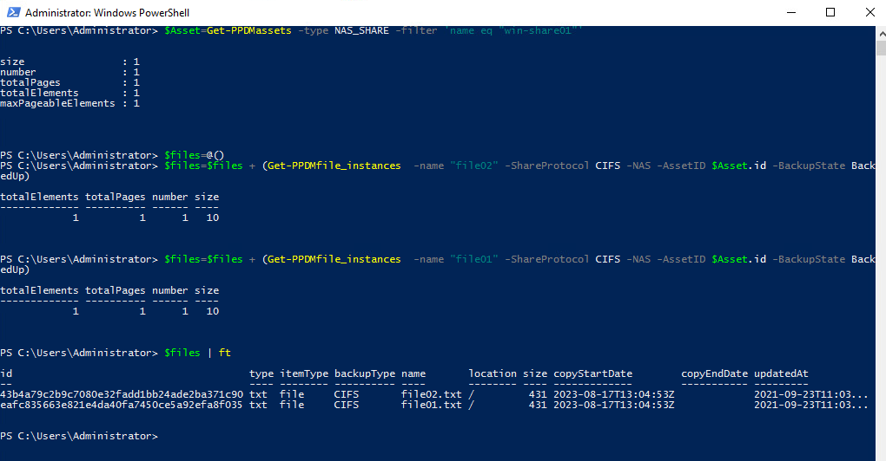
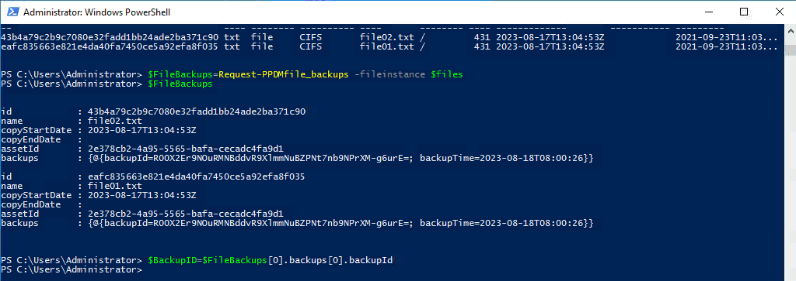
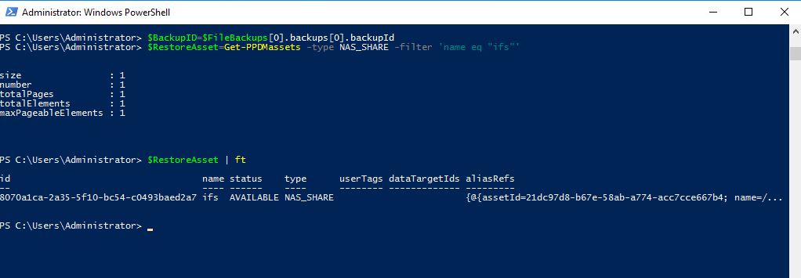

# MODULE 10 - DYNAMIC NAS PROTECTION

## LESSON 3 -PERFORM A FILE SEARCH AND RESTORE FILES TO ALTERNATE SHARE

## Search for files in on NAS

The *Get-PPDMfile_instances* can search VM Indexes for Specific Files.

The Command can Construct Complex Search queries as in the UI. For VM´s the Following syntax ios available:

```Powershell
Get-PPDMfile_instances -NAS [-ShareProtocol {CIFS | NFS}] [-BackupState {Skipped | BackedUp}] [-name <Object>] [-location <Object>]
[-filesonly] [-filetype <Object>] [-minsize <Object>] [-minsizeUnit {KB | MB | GB | TB}] [-maxsize <Object>] [-maxsizeUnit {KB | MB |
GB | TB}] [-CreatedAtStart <datetime>] [-CreatedAtEnd <datetime>] [-modifiedAtStart <datetime>] [-modifiedAtEnd <datetime>]
[-LastBackupOnly] [-BackupAtStart <datetime>] [-BackupAtEnd <datetime>] [-SourceServer <string>] [-AssetID <string>] [-pageSize
<Object>] [-page <Object>] [-body <hashtable>] [-PPDM_API_BaseUri <Object>] [-apiver <Object>]  [<CommonParameters>]
```

As per Lab Guide, we need to search the following Spec:

> Key in "file0" in the File/Folder Name

We will limit our search to the Asset win-share01:. If not done from the previous Session, do  

```Powershell
$Asset=Get-PPDMassets -type NAS_SHARE -filter 'name eq "win-share01"'
```

The lab Guide wants to select 2 Files, file01 and file02. We will Scope them into a Powershell Array for subsequent Commands:

```Powershell
$files=@()
$files=$files + (Get-PPDMfile_instances  -name "file02" -ShareProtocol CIFS -NAS -AssetID $Asset.id -BackupState BackedUp)
$files=$files + (Get-PPDMfile_instances  -name "file01" -ShareProtocol CIFS -NAS -AssetID $Asset.id -BackupState BackedUp)
$files | ft
```



We need to getThe Backup/CopyID from the selected files:

```Powershell
$FileBackups=Request-PPDMfile_backups -fileinstance $files
$FileBackups | ft
$BackupID=$FileBackups[0].backups[0].backupId
```

## Define Restore Target Objects


ARread the Asset ID of the Target Share, ifs

```Powershell
$RestoreAsset=Get-PPDMassets -type NAS_SHARE -filter 'name eq "ifs"'
$RestoreAsset | ft
```



Also, we need to Provide the Credential for the Target share.  
Therefore, create a Credential:

```Powershell
$Securestring=ConvertTo-SecureString -AsPlainText -String "Password123!" -Force
$username="root"
$Credentials = New-Object System.Management.Automation.PSCredential($username, $Securestring)
```

## Start the Restore

```Powershell
Restore-PPDMNasFiles -copyID $BackupID -Fileobject $files -AssetID $RestoreAsset.id -targetdirectory "ifs" -credential $credential  -restoreTopLevelACLs
```

Monitor the Activity:

```Powershell
Get-PPDMactivities -filter "category eq `"RESTORE`" and name lk `"%Recovering NAS File/Folder%`""
```

[<<Module 10 Lesson 2](./Module_10_2.md) This Concludes Module 10 Lesson 3 [Module 11 Lesson 1 >>](./Module_11_1.md)
