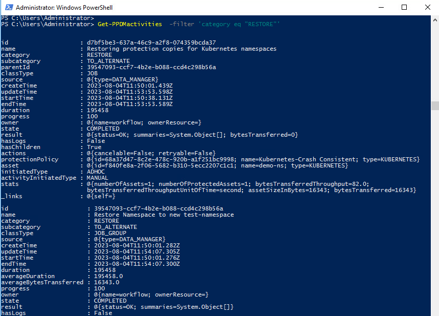
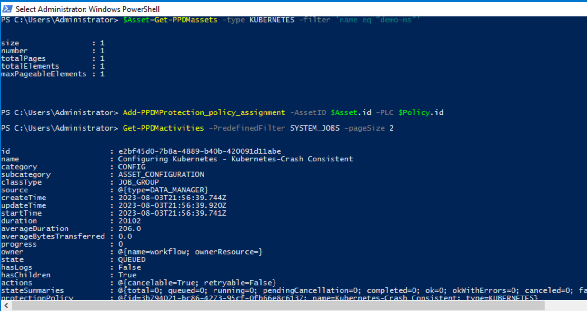
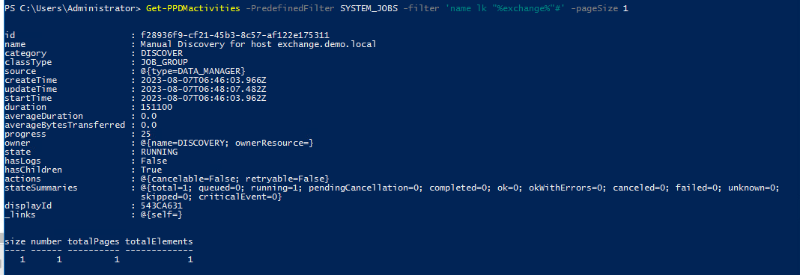
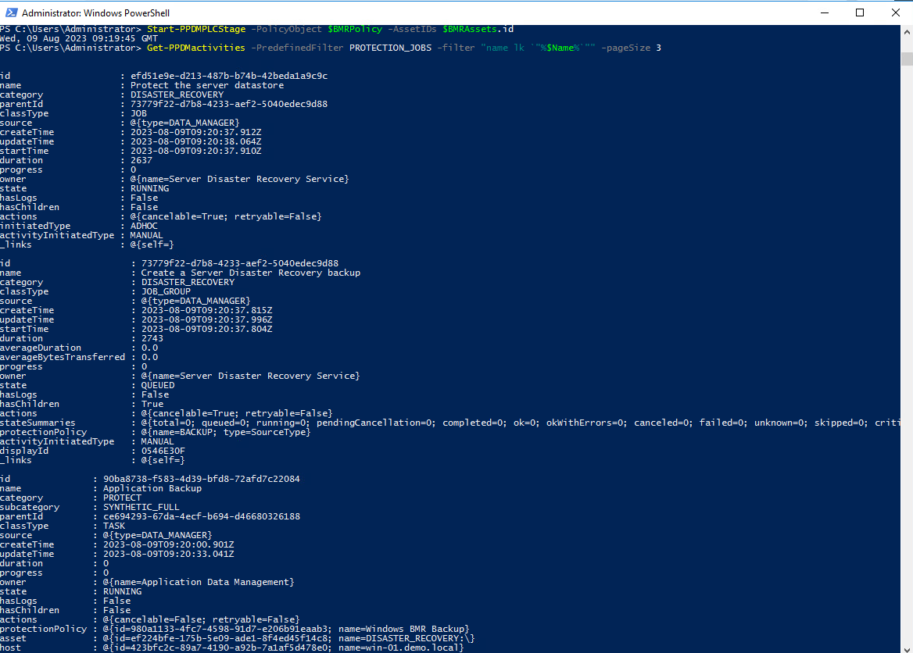
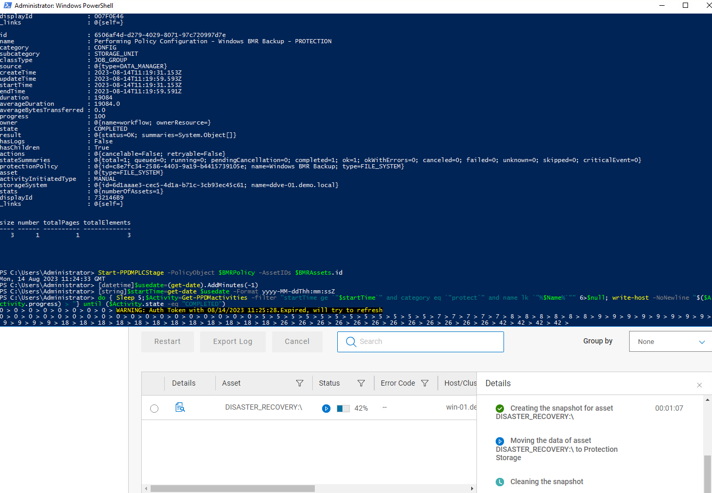
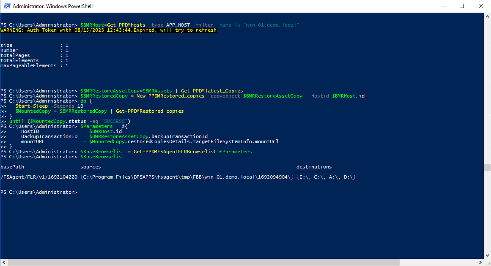

# MODULE 3 - PROTECT VMWARE VIRTUAL MACHINES - MODULE OVERVIEW

## LESSON 1 - DISCOVER VIRTUAL MACHINES

In this lesson we simulate adding of a vCenter in Powershell.  
As a vCenter is already preconfigured in the Environemnt, we can only look at the existing and change some settings

### Get an existing vCenter Asset source

```Powershell
Get-PPDMinventory_sources -Type VCENTER -filter 'address eq "vcsa-7.demo.local"'
```

You should see the vCenter configuration now:


### The Normal Process of onboarding a vCenter from Powershell would be

- Creating a vCenter Credential in PPDM
- Approving the Certificate
- Adding the vCenter

To Add  new vCenter Credntials in ppdm, run the command

```Powershell
$CREDS=New-PPDMcredentials -type VCENTER -name testcreds
$CREDS
```

with the Credentials <administrator@vsphere.local> / Password123!

To approve tghe Certificate ( also good for refreshing Certs) use the following Powershell Code

```Powershell
Get-PPDMcertificates -newhost vcsa-7.demo.local -port 443 | Approve-PPDMcertificates
```



Now we  would be ready to add the new vCenter

```Powershell
Add-PPDMinventory_sources -Hostname vcsa-7.demo.local -port 443 -Type VCENTER -isHostingvCenter -ID $CREDS.id -Name "DEMO VCENTER"
```

This command is expected to fail as the Inventory already exists


### INCREMENTAL DISCOVERY

Start an icremental discovery using the function *Start-PPDMdiscoveries*

```Powershell
Get-PPDMinventory_sources -Type VCENTER -filter 'address eq "vcsa-7.demo.local"' | Start-PPDMdiscoveries -level DataCopies -start inventory-sources
```



With the Knowledge from Module 1, we can now review the discovery activity:

```Powershell
# Replace your Discovery ID here
Get-PPDMactivities -id 1ff60683-41e4-4389-8db7-38a549bc8ba4 
```


### SET THRESHOLD LIMITS

Get the VM Backup Threshold Settings 

```Powershell
Get-PPDMvm_backup_setting
```


Review the Properties before we chage:

```Powershell
$VMsettings=Get-PPDMvm_backup_setting
$VMsettings.properties
```


Adjust the Values and review

```Powershell
$VMsettings.properties[0].value=10
$VMsettings.properties[1].value=5
$VMsettings.properties
```


Apply the Settings

```Powershell
Set-PPDMvm_backup_setting -vm_backup_setting $VMsettings
```


## LESSON 2 - PROTECT VIRTUAL MACHINES USING PROTECT VIRTUAL MACHINES USING TRANSPARENT SNAPSHOT DATA MOVER(CRASH CONSISTENT)

We use a Helper Fuction *New-PPDMBackupSchedul* to Create a Stage0 Backu Schedule Object that we will use in the Protection Policy

```Powershell
$Schedule=New-PPDMBackupSchedule -hourly -CreateCopyIntervalHrs 8 -RetentionUnit DAY -RetentionInterval 2
```

Also, we want to Create a ServiceLevelAgreement that we link to the Policy:

```Powershell
$SLA=New-PPDMBackupService_Level_Agreements -NAME PLATINUM -RecoverPointObjective -RecoverPointUnit HOURS -RecoverPointInterval 24 -DeletionCompliance -ComplianceWindow -ComplianceWindowCopyType ALL
```

In addition, we need to identify the StorageSystem to backup to.

```Powershell
$StorageSystem=Get-PPDMStorage_systems -Type DATA_DOMAIN_SYSTEM -Filter {name eq "ddve-01.demo.local"}
```

Once we identified and created the Ressources alligned to the Policy, we create the Policy with

```Powershell
New-PPDMVMBackupPolicy -Schedule $Schedule -Name "Linux VM" -Description "Protect Linux VM" -backupMode FSS -StorageSystemID $StorageSystem.id -SLAId $SLA.id
```


Now we need to Assign the Asset(s) to the Protection Policy. Therefore, we filter an asset query to the VM LINUX-01:

```Powershell
$Asset=Get-PPDMassets -type VMWARE_VIRTUAL_MACHINE -filter 'name eq "LINUX-01"'
```

Copying the Policy Id from the Previously create Policy, we can run

```Powershell
Add-PPDMProtection_policy_assignment -AssetID $Asset.id -ID 1c522005-ea7b-4309-8527-b02542bbd281
```


View the Running Jobs

```Powershell
Get-PPDMactivities -PredefinedFilter ASSET_JOBS -pagesize 2
```



```Powershell
Get-PPDMactivities -PredefinedFilter SYSTEM_JOBS -pageSize 2
```



```Powershell
Get-PPDMactivities -PredefinedFilter PROTECTION_JOBS -pageSize 2
```



There are Several ways to start a Protection Policy. For an AdHoc Protection, we would select  and individual Asset and start the Protection with the given Stage0 defaults of the Policy.

So first, we re-read the existing $Asset, as it now contains the Protection policy after Assignment

```Powershell

```

Next, we get the Protection Policy Object, whicht includes the Details of Stage0

```Powershell

```

Finally, we start the Asset Protection for the Asset ID

```Powershell

```


View the Latest Asset Jobs

```Powershell

```

