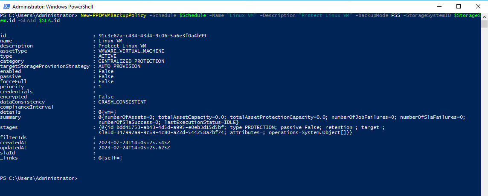
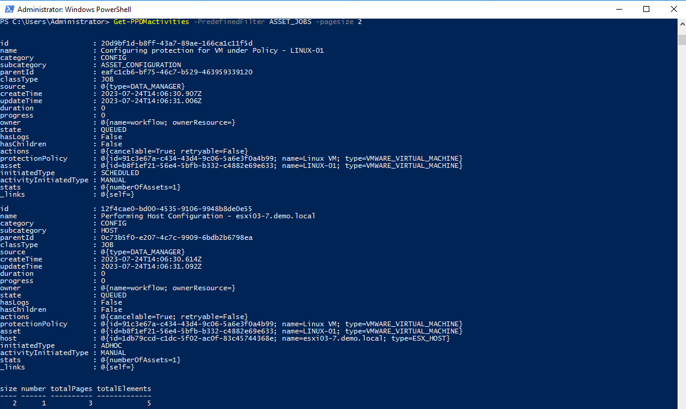
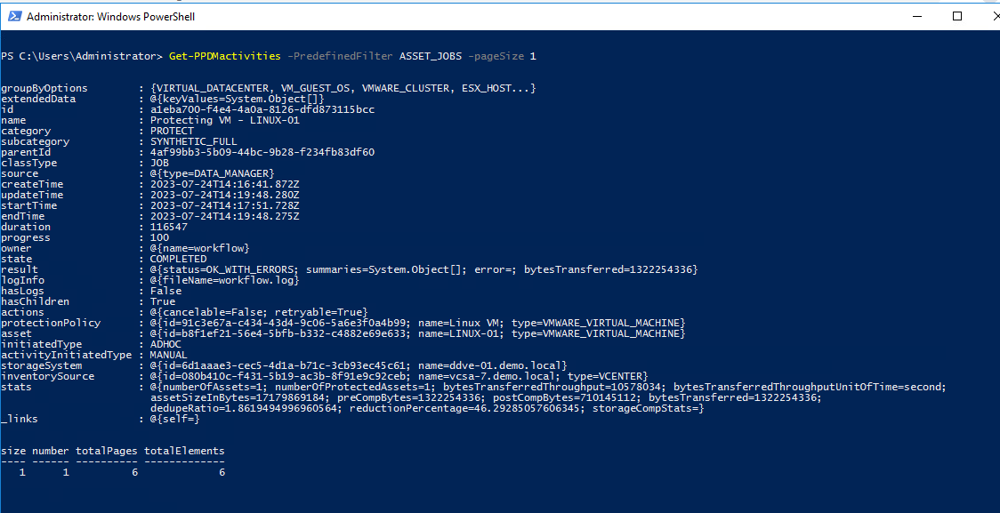

# MODULE 3 - PROTECT VMWARE VIRTUAL MACHINES

## LESSON 2 - USING PROTECT VIRTUAL MACHINES USING TRANSPARENT SNAPSHOT DATA MOVER(CRASH CONSISTENT)

We use a Helper Fuction *New-PPDMBackupSchedul* to Create a Stage0 Backu Schedule Object that we will use in the Protection Policy

```Powershell
$Schedule=New-PPDMBackupSchedule -hourly -CreateCopyIntervalHrs 8 -RetentionUnit DAY -RetentionInterval 2
```

Also, we want to Create a ServiceLevelAgreement that we link to the Policy:

```Powershell
$SLA=New-PPDMBackupService_Level_Agreements -NAME PLATINUM -RecoverPointObjective -RecoverPointUnit HOURS -RecoverPointInterval 24 -DeletionCompliance -ComplianceWindow -ComplianceWindowCopyType ALL
```

In addition, we need to identify the StorageSystem to backup to.

```Powershell
$StorageSystem=Get-PPDMStorage_systems -Type DATA_DOMAIN_SYSTEM -Filter {name eq "ddve-01.demo.local"}
```

Once we identified and created the Ressources alligned to the Policy, we create the Policy with

```Powershell
New-PPDMVMBackupPolicy -Schedule $Schedule -Name "Linux VM" -Description "Protect Linux VM" -backupMode FSS -StorageSystemID $StorageSystem.id -SLAId $SLA.id
```



Now we need to Assign the Asset(s) to the Protection Policy. Therefore, we filter an asset query to the VM LINUX-01:

```Powershell
$Asset=Get-PPDMassets -type VMWARE_VIRTUAL_MACHINE -filter 'name eq "LINUX-01"'
```

Copying the Policy Id from the Previously create Policy, we can run

```Powershell
Add-PPDMProtection_policy_assignment -AssetID $Asset.id -ID 1c522005-ea7b-4309-8527-b02542bbd281
```


View the Running Jobs

```Powershell
Get-PPDMactivities -PredefinedFilter ASSET_JOBS -pagesize 2
```



```Powershell
Get-PPDMactivities -PredefinedFilter SYSTEM_JOBS -pageSize 2
```


```Powershell
Get-PPDMactivities -PredefinedFilter PROTECTION_JOBS -pageSize 2
```


There are Several ways to start a Protection Policy. For an AdHoc Protection, we would select  and individual Asset and start the Protection with the given Stage0 defaults of the Policy.

So first, we re-read the existing $Asset, as it now contains the Protection policy after Assignment

```Powershell
$Asset=$Asset | Get-PPDMassets
```

Next, we get the Protection Policy Object, whicht includes the Details of Stage0

```Powershell
$Policy=Get-PPDMprotection_policies -id $Asset.protectionPolicy.id
```

Finally, we start the Asset Protection for the Asset ID

```Powershell
Start-PPDMprotection -PolicyObject $Policy -AssetIDs $Asset.id
```


View the Latest Asset Jobs

```Powershell
Get-PPDMactivities -PredefinedFilter ASSET_JOBS -pageSize 1
```



[TLDR](./scripts/Module_3_1.ps1)

 [<<Module 3 Lesson 1](./Module_3_1.md) This Concludes Module 3 Lesson 2 [Module 3 Lesson 3 >>](./Module_3_3.md)