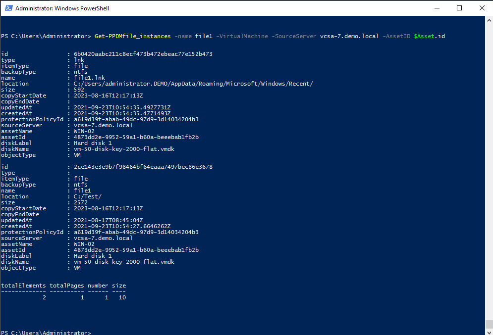

# MODULE 4 - PROTECT SQL DATABASES

## LESSON 1 - DISCOVER SQL DATABASES

Review the Agent Regitration Status.

```Powershell
Get-PPDMagent_registration_status
```

The Command will output all Agents Registrations


Agents cann be approved via the *Set-PPDMWhitelist* Function, eiter from ID or from Pipeline

```Powershell
Get-PPDMWhitelist | Set-PPDMWhitelist -state APPROVED
```


Lets start a discover for host *sql-02.demo.local*

```Powershell
Get-PPDMhosts -filter 'name eq"sql-02.demo.local"' | Start-PPDMdiscoveries -level HOSTFULL -start hosts
```



```Powershell
Get-PPDMactivities -taskid <Use TaskID from you discover to check the activity>
```

Now lets have a look at the Discovered Databases


```Powershell
Get-PPDMassets -type MICROSOFT_SQL_DATABASE -filter 'details.database.clusterName eq "sql-02.demo.local"' | ft
```


Get-PPDMassets -type MICROSOFT_SQL_DATABASE -filter 'details.database.clusterName eq "sql-02.demo.local" and name lk "SQLPROD%"' | Set-PPDMMSSQLassetStreamcount -LogStreamCount 10 -FullStreamCount 10 -DifferentialStreamCount 10

(Get-PPDMassets -type MICROSOFT_SQL_DATABASE -filter 'details.database.clusterName eq "sql-02.demo.local" and name lk "SQLPROD%"').backupDetails