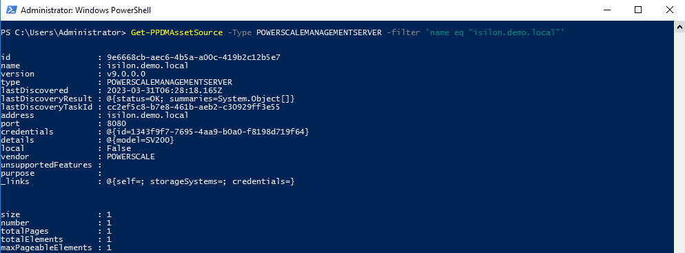
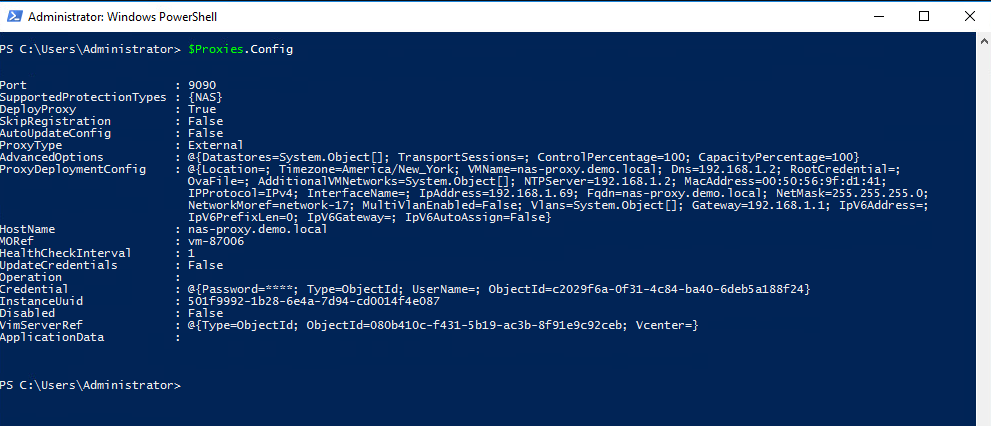
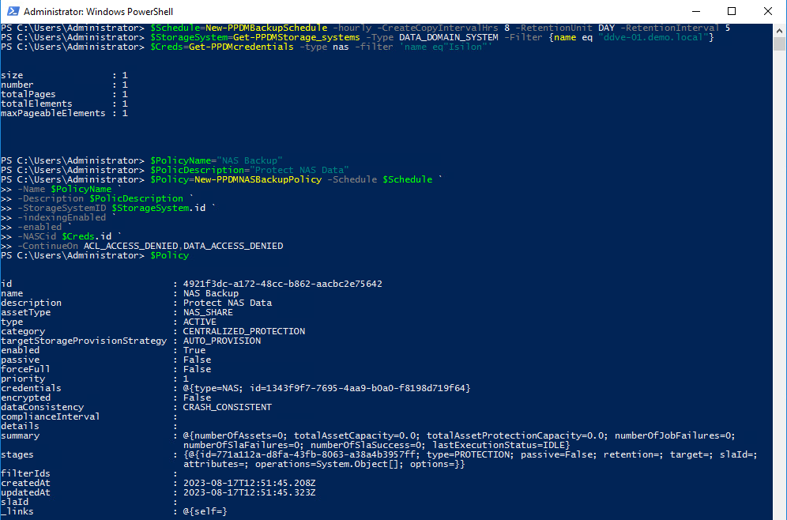

# MODULE 4 - PROTECT SQL DATABASES

## LESSON 2 - PROTECT SQL DATABASES

Look at the Databases we discovered in lesson 1. As Asset Protection Properties, such es excludes, stream counts etc. are set atr the Asset level individually, we are going to change some Asset Level Properties. 

```Powershell
Get-PPDMassets -type MICROSOFT_SQL_DATABASE -filter 'details.database.clusterName eq "sql-02.demo.local"' | ft
```



As we can see, Stream Counts are set to 4 for Full and Differential, and to 1 for logs.  
We change this with

```Powershell
Get-PPDMassets -type MICROSOFT_SQL_DATABASE -filter 'details.database.clusterName eq "sql-02.demo.local" and name lk "SQLPROD%"' | Set-PPDMMSSQLassetStreamcount -LogStreamCount 10 -FullStreamCount 10 -DifferentialStreamCount 10
```

And then have a Look at the Result:
```Powershell
(Get-PPDMassets -type MICROSOFT_SQL_DATABASE -filter 'details.database.clusterName eq "sql-02.demo.local" and name lk "SQLPROD%"').backupDetails
```


Time to create a Backup Poliy. At this time, we define 2 Stage 0 Backups. One it the Full schdeule, and one the Differentail both share the same retention in Stage 0, but different Intervals.
From the LAB Gude, we will use the following Settings:
>Name: SQL PROD Databases
>Description: SQL DB Backups
>Type: Microsoft SQL
>Recurrence: Hourly
>Create Full: 1 Hour
>Keep For: 5 days
>Start Time: 8:00 PM
>End Time:  6:00 AM

We create a Schdeule using the Schedule Helper for Databases:

```Powershell
$Schedule=New-PPDMDatabaseBackupSchedule -hourly -CreateCopyIntervalHrs 1 -DifferentialBackupUnit MINUTELY -DifferentialBackupInterval 30 -RetentionUnit DAY -RetentionInterval 5
```

Then, we read the Storage System into a Variable

```Powershell
$StorageSystem=Get-PPDMStorage_systems -Type DATA_DOMAIN_SYSTEM -Filter {name eq "ddve-01.demo.local"}
```

As we are going to use the same OS Credentials we used in a Previous excersise, we do a 

```Powershell
$credentials=Get-PPDMcredentials -filter 'name eq "windows"'
```

And Create a new Protection Policy from the 3 Variables

```Powershell
New-PPDMSQLBackupPolicy -Schedule $Schedule -Name "SQL PROD DATABASE" -Description "SQL DB Backups" -skipUnprotectableState -dbCID $credentials.id -StorageSystemID $StorageSystem.id -
```




For output reasons we did not assign the result of the command  to a Variable. But we an leverage the filter api do do so. We Always use Filters to query for Human Readable Entities, otherwise we would select by id:

```Powershell
$Policy=Get-PPDMprotection_policies -filter 'name eq "SQL PROD DATABASE"'
```

Lets to the same with the SQL Assets we are going to assign to the Policy:

```Powershell
$Assets=Get-PPDMassets -type MICROSOFT_SQL_DATABASE -filter 'details.database.clusterName eq "sql-02.demo.local" and name lk "SQLPROD%"'
```

Do Similar  for the Always On Databases

```Powershell
$Assets+=Get-PPDMassets -type MICROSOFT_SQL_DATABASE -filter 'details.database.clusterName eq "sqlaag-01.demo.local" and name lk "DemoDB-0%"'
```

Now assign the Assets to the Policy. The Policy Assignment Alows a List of Assets to be assigned. Multiple Asset IDS can be called from Assets.id
We the Pipe the $Policy to *Get-PPDMprotection_policies* to get a refresed list of the Policy

```Powershell
Add-PPDMProtection_policy_assignment -id $Policy.id -AssetID $Assets.id
$Policy | Get-PPDMprotection_policies
```

