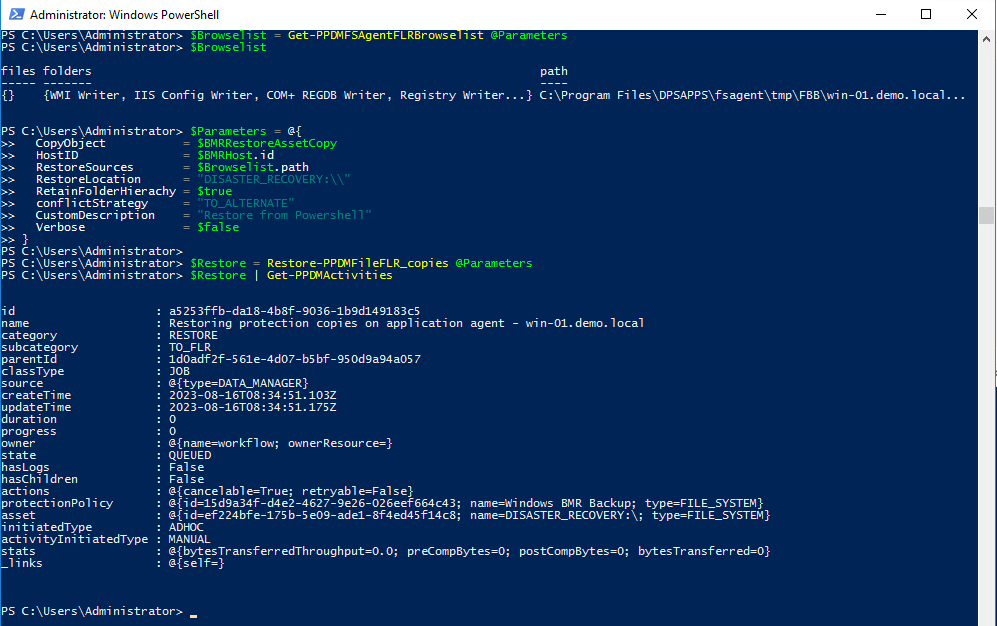

# MODULE 4 - PROTECT SQL DATABASES

## LESSON 3 - RECOVER SQL DATABASES

This will perform a Centralized Restore


```Powershell
$RestoreFromHost = "sql-02.demo.local"
$RestoreToHost_Name = "sql-02.demo.local"
$AppServerName = "MSSQLSERVER"
$DataBaseName = "SQLPROD-01"
```

## Read our Restore Host

```Powershell
$RestoreHostFilter = 'attributes.appHost.applicationsOfInterest.type eq "MSSQL" and not (lastDiscoveryStatus eq "DELETED") and details.appHost.os eq "WINDOWS" and hostname eq "' + $RestoreToHost_Name + '"'
$RestoreToHost = Get-PPDMhosts -filter $RestoreHostFilter
$RestoreToHost
```


## Read the Asset to restore to identify the Asset Copies

```Powershell
$RestoreAssetFilter = 'type eq "MICROSOFT_SQL_DATABASE" and protectionStatus eq "PROTECTED" and details.database.clusterName eq "' + $RestoreFromHost + '"' + ' and details.database.appServerName eq "' + $AppServerName + '"'
$RestoreAssets = Get-PPDMAssets -Filter $RestoreAssetFilter
$RestoreAssets = $RestoreAssets | Where-Object name -Match $DataBaseName
# Optionally, look at the CopyMap
# $Copymap=$RestoreAssets | Get-PPDMcopy_map
```

## Selecting the Asset Copy to Restore
we have multiple options to select a Copy.....

### Using the latest copy

```Powershell
Get-PPDMlatest_copies -assetID $RestoreAssets.id
```



### by Filering for a Date Range ...
```Powershell
write-host "Selecting Asset-copy for $DataBaseName"
$myDate = (get-date).AddDays(-1)
$usedate = get-date $myDate -Format yyyy-MM-ddThh:mm:ssZ
$RANGE_FILTER = 'startTime ge "' + $usedate + '"state eq "IDLE"'
# $RestoreAssets | Get-PPDMassetcopies -filter $RANGE_FILTER
$RestoreAssetCopy = $RestoreAssets | Get-PPDMassetcopies -filter $RANGE_FILTER | Select-Object -First 1
```

For now, we use the Latest Copy Function 

```Powershell
$RestoreAssetCopy = Get-PPDMlatest_copies -assetID $RestoreAssets.id
```


## Run the Restore

This time we Specify Parameters in a Parameters Block as this makes it easier to use Options in Scripts

```Powershell
$Parameters = @{
  HostID                  = $RestoreToHost.id 
  appServerId             = $RestoreAssets.details.database.appServerId
  copyObject              = $RestoreAssetCopy
  enableDebug             = $false
  disconnectDatabaseUsers = $true
  restoreType             = "TO_ALTERNATE" 
  CustomDescription       = "Restore from Powershell"
  Verbose                 = $false
}
```

And finally start the Restore Job:

```Powershell
$Restore = Restore-PPDMMSSQL_copies @Parameters
```

## Monitor the Restore

```Powershell
$Restore | Get-PPDMRestored_copies
$Restore | Get-PPDMactivities
```


Lets wait until activity Completed:

```Powershell
do { Sleep 5; $Activity=$Restore | Get-PPDMactivities; write-host $Activity.progress } until ($Activity.state -eq "COMPLETED")
```

[<<Module 4 Lesson 1](./Module_4_1.md) This Concludes Module 4 Lesson 2 [Module 4 Lesson 3>>](./Module_4_3.md)