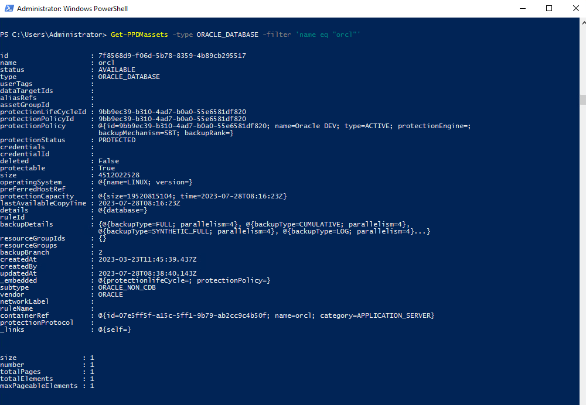
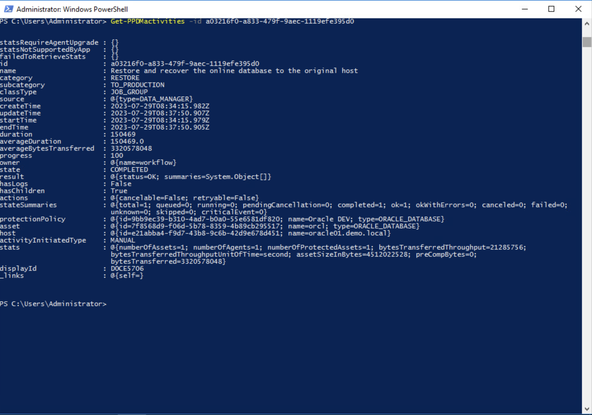

# MODULE 5 - PROTECT & RESTORE ORACLE DATABASE FROM POWERSHELL

## LESSON 3 - PERFORM CENTRALIZED ORACLE DATABASE RESTORE


## IMPORTANT FOLLLOW THE LAB GUIDE TO PREPARE THE  ORACLE Server:

- click on the Royal TS icon located on the Desktop
- Connect to oracle01.demo.local
- Double-click on oracle01 to connect to oracle01.demo.local
- 'su - oracle' to switch to oracle use wirh Password123!
- 'sqlplus "/as sysdba" and wait for the SQL> prompt
- select status from v$instance;
- shutdown immediate;
- startup nomount;


## Identify our Asset

>DatabaseName: oracl

```Powershell
$Asset=Get-PPDMassets -type ORACLE_DATABASE -filter 'name eq "orcl"'
$Asset
# Note you can also add the Server name if you have multiple DB Assets with te same Name...
# $Asset=Get-PPDMassets -type ORACLE_DATABASE -filter 'details.database.clusterName eq "oracle01.demo.local" and name eq "orcl"'
```



## Get your Asset Copies

To get all Copies of an asset, or use custom filters, use *Get-PPDMassetcopies*

```Powershell
$Asset | Get-PPDMassetcopies | ft
```


For the latest copy of an asset, use

```Powershell
$Asset | Get-PPDMlatest_copies
```


We need to read our Oracle Host

```Powershell
$OraHost=Get-PPDMhosts -type APP_HOST -filter 'name eq "oracle01.demo.local"'
```

## Run the Restore

```Powershell
Restore-PPDMOracle_copies -copyobject $CopyObject -appServerID $Asset.details.database.appServerId -HostID $OraHost.id  -Verbose -crossCheckBackup -OraCredObject $OraCreds
```

## run the restore

```Powershell
Restore-PPDMOracle_copies -copyobject $CopyObject -appServerID $Asset.details.database.appServerId -HostID $OraHost.id -crossCheckBackup -OraCredObject $OraCreds
```

## Get the Status of the Activity from Restore

```Powershell
Get-PPDMactivities -id a03216f0-a833-479f-9aec-1119efe395d0
```


you may want to repeat the Command or create a loop that monitors the activities
( will be handled in an Advanced Session later)

```Powershell
Get-PPDMactivities -id a03216f0-a833-479f-9aec-1119efe395d0
```



[<<Module 5 Lesson 2](./Module_5_2.md) This Concludes Module 5 Lesson 3 [Module 5 Lesson 3>>](./Module_5_3.md)
