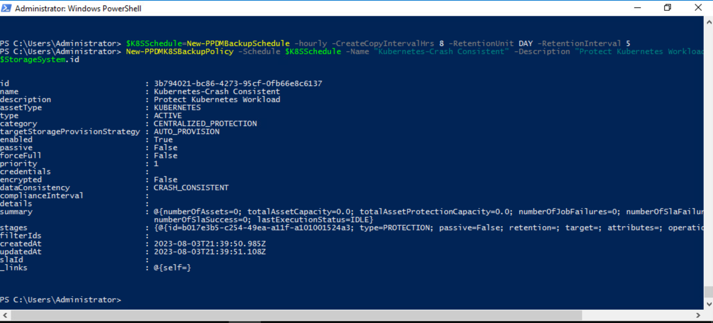
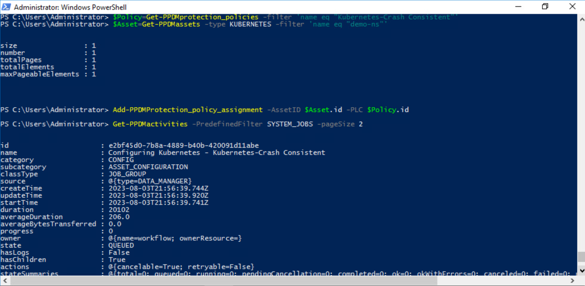
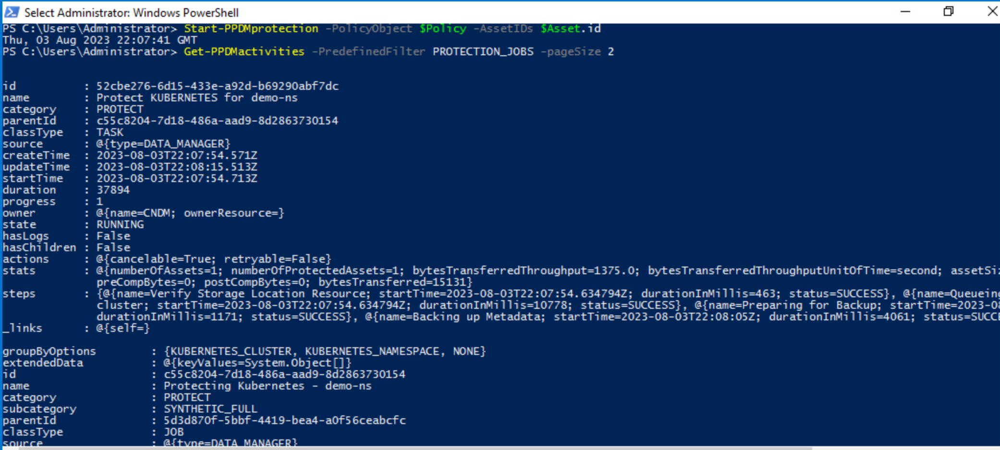

# MODULE 6 - PROTECT KUBERNETES WORKLOAD

## LESSON 1 - PROTECT KUBERNETES WORKLOADS - CRASH CONSISTENT BACKUPS

This lesson will help you create a Protection Policy to configure  backups for namespace discovered

If not already done from Previous Module, read the Storage System

```Powershell
$StorageSystem=Get-PPDMStorage_systems -Type DATA_DOMAIN_SYSTEM -Filter {name eq "ddve-01.demo.local"}
```


As in previous section, we first create a Backup Schedule with the Helper Funktion

>Recurrence : Hourly
>Create every : 8
>Keep for : 5
>Start time : 8 PM 
>End Time : 6 AM

```Powershell
$K8SSchedule=New-PPDMBackupSchedule -hourly -CreateCopyIntervalHrs 8 -RetentionUnit DAY -RetentionInterval 5
```

Next, we are going to create the ProtectionPolicy:

>Name: Kubernetes-Crash Consistent
>Description : Protect Kubernetes Workload
>Type : Kubernetes


```Powershell
New-PPDMK8SBackupPolicy -Schedule $K8SSchedule -Name "Kubernetes-Crash Consistent" -Description "Protect Kubernetes Workload" -enabled -StorageSystemID $Storage.id
```



once the Policy is created, we need to assign a Kubernetes Asset, the Namespace

```Powershell
$Policy=Get-PPDMprotection_policies -filter 'name eq "Kubernetes-Crash Consistent"'
$Asset=Get-PPDMassets -type KUBERNETES -filter 'name eq "demo-ns"'
```

```Powershell
Add-PPDMProtection_policy_assignment -AssetID $Asset.id -PLC $Policy.id
```



```Powershell
Get-PPDMactivities -PredefinedFilter SYSTEM_JOBS -pageSize 2
```


```Powershell
Start-PPDMprotection -PolicyObject $Policy -AssetIDs $Asset.id
```

```Powershell
Get-PPDMactivities -PredefinedFilter PROTECTION_JOBS -pageSize 2
```

