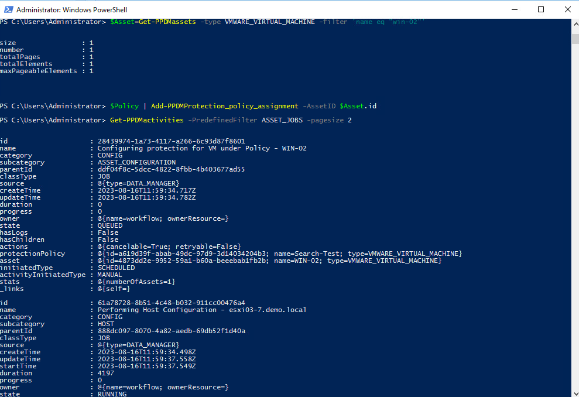

# MODULE 9 - INDEX & SEARCH FOR VMWARE BACKUPS

## LESSON 1 - Index Virtual Machine Backups and Validate Search

We use a Helper Fuction *New-PPDMBackupSchedule* to Create a Stage0 Backup Schedule Object that we will use in the Protection Policy

>Recurrence: Hourly  
>Create Copy: 8 Hours  
>Keep For: 5 Days  
>Start Time: 08:00 PM  
>End Time: 06:00 AM  

```Powershell
$Schedule=New-PPDMBackupSchedule -hourly -CreateCopyIntervalHrs 8 -RetentionUnit DAY -RetentionInterval 5
```

In addition, we need to identify the StorageSystem to backup to.

```Powershell
$StorageSystem=Get-PPDMStorage_systems -Type DATA_DOMAIN_SYSTEM -Filter {name eq "ddve-01.demo.local"}
```

Once we identified and created the Ressources aligned to the Policy, we create the Policy with

>Name: Search-Test  
>Description: VM Backups with Indexing enabled  
>Type: Virtual Machine  

```Powershell
$PolicyName="Search-Test"
$PolicDescription="VM Backups with Indexing enabled"
$Policy=New-PPDMVMBackupPolicy -Schedule $Schedule `
-Name $PolicyName `
-Description $PolicDescription `
-backupMode FSS `
-StorageSystemID $StorageSystem.id `
-indexingEnabled `
-enabled
$Policy

```


Now we need to Assign the Asset(s) to the Protection Policy. Therefore, we filter an asset query to the VM LINUX-01:

```Powershell
$Asset=Get-PPDMassets -type VMWARE_VIRTUAL_MACHINE -filter 'name eq "win-02"'
```

Copying the Policy Id from the Previously create Policy, we can run

```Powershell
$Policy | Add-PPDMProtection_policy_assignment -AssetID $Asset.id
```

View the Running Jobs

```Powershell
Get-PPDMactivities -PredefinedFilter ASSET_JOBS -pagesize 2
```



```Powershell
Get-PPDMactivities -PredefinedFilter SYSTEM_JOBS -pageSize 2
```


```Powershell
Get-PPDMactivities -PredefinedFilter PROTECTION_JOBS -pageSize 2
```


There are Several ways to start a Protection Policy. For an AdHoc Protection, we would select  and individual AssetId and start the Protection with the given Stage0 defaults of the Policy.

```Powershell
Start-PPDMprotection -PolicyObject $Policy -AssetIDs $Asset.id
```


View the Latest Asset Jobs

```Powershell
Get-PPDMactivities -PredefinedFilter ASSET_JOBS -pageSize 1
```


 [<<Module 3 Lesson 1](./Module_3_1.md) This Concludes Module 3 Lesson 2 [Module 3 Lesson 3 >>](./Module_3_3.md)