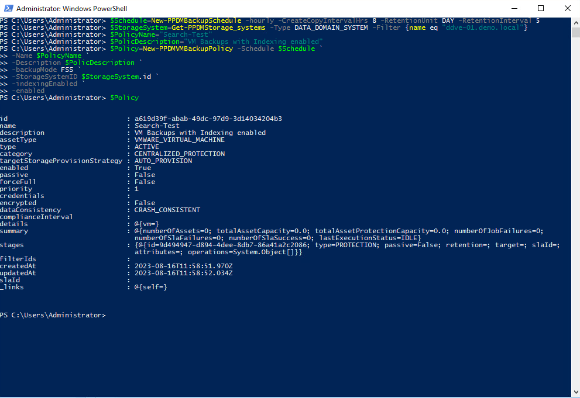
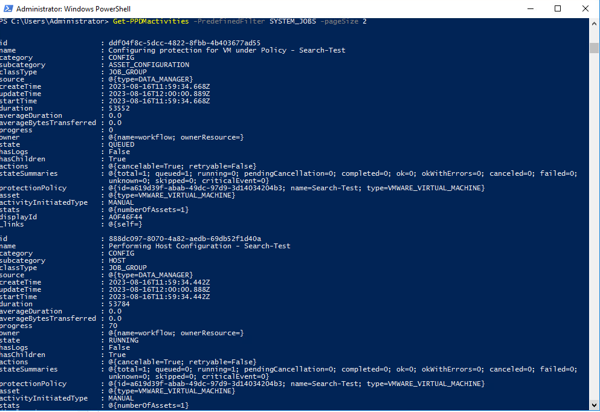

# MODULE 9 - INDEX & SEARCH FOR VMWARE BACKUPS

## LESSON 1 - Index Virtual Machine Backups and Validate Search

## Create a Policy

We use a Helper Fuction *New-PPDMBackupSchedule* to Create a Stage0 Backup Schedule Object that we will use in the Protection Policy

>Recurrence: Hourly  
>Create Copy: 8 Hours  
>Keep For: 5 Days  
>Start Time: 08:00 PM  
>End Time: 06:00 AM  

```Powershell
$Schedule=New-PPDMBackupSchedule -hourly -CreateCopyIntervalHrs 8 -RetentionUnit DAY -RetentionInterval 5
```

In addition, we need to identify the StorageSystem to backup to.

```Powershell
$StorageSystem=Get-PPDMStorage_systems -Type DATA_DOMAIN_SYSTEM -Filter {name eq "ddve-01.demo.local"}
```

Once we identified and created the Ressources aligned to the Policy, we create the Policy with

>Name: Search-Test  
>Description: VM Backups with Indexing enabled  
>Type: Virtual Machine  

```Powershell
$PolicyName="Search-Test"
$PolicDescription="VM Backups with Indexing enabled"
$Policy=New-PPDMVMBackupPolicy -Schedule $Schedule `
-Name $PolicyName `
-Description $PolicDescription `
-backupMode FSS `
-StorageSystemID $StorageSystem.id `
-indexingEnabled `
-enabled
$Policy

```



## Assign VM to the Policy

Now we need to Assign the Asset(s) to the Protection Policy. Therefore, we filter an asset query to the VM LINUX-01:

```Powershell
$Asset=Get-PPDMassets -type VMWARE_VIRTUAL_MACHINE -filter 'name eq "win-02"'
```

Using the Policy Object from the Previously create Policy, we can run

```Powershell
$Policy | Add-PPDMProtection_policy_assignment -AssetID $Asset.id
```

## Monitoring the Activities

View the Running Jobs

```Powershell
Get-PPDMactivities -PredefinedFilter ASSET_JOBS -pagesize 2
```


```Powershell
Get-PPDMactivities -PredefinedFilter SYSTEM_JOBS -pageSize 2
```



```Powershell
Get-PPDMactivities -PredefinedFilter PROTECTION_JOBS -pageSize 2
```


## Start an AdHoc protection

There are Several ways to start a Protection Policy. For an AdHoc Protection, we would select  and individual AssetId and start the Protection with the given Stage0 defaults of the Policy.

```Powershell
Start-PPDMprotection -PolicyObject $Policy -AssetIDs $Asset.id
```

Monitor the Backups with:

```Powershell
Get-PPDMactivities -filter "category eq `"protect`" and name lk `"%$PolicyName%`"" -pageSize 3 6> out-null | ft state, progress, name
```

Or in a loop:

```Powershell
do { Sleep 5;$Activity=Get-PPDMactivities -filter "category eq `"protect`" and name lk `"%$PolicyName%`"" 6>$null; write-host -NoNewline "$($Activity.progress)% "} until ($Activity.state -eq "COMPLETED")
```


## Monitor Indexing

Indexing will start right after the Backup.
As with category protect, we can use the category indexing to Mounitor:  

```Powershell
Get-PPDMactivities -filter "category eq `"index`" and name lk `"%$PolicyName%`"" -pageSize 3 6> out-null
Get-PPDMactivities -filter "category eq `"index`" and name lk `"%$PolicyName%`"" -pageSize 3 6> out-null | ft state, progress, name
```

Or in a loop:

```Powershell
do { Sleep 5;$Activity=Get-PPDMactivities -filter "category eq `"index`" and name lk `"%$PolicyName%`"" 6>$null; write-host -NoNewline "$($Activity.progress)% "} until ($Activity.state -eq "COMPLETED")
```


## Search for files in VM´s

The *Get-PPDMfile_instances* can search VM Indexes for Specific Files.

The Command can Construct Complex Search queries as in the UI. For VM´s the Following syntax ios available:

```Powershell
Get-PPDMfile_instances -VirtualMachine [-GuestOS {LINUX | WINDOWS}] [-name <Object>] [-location <Object>] [-filesonly] [-filetype <Object>] [-minsize <Object>] [-minsizeUnit {KB | MB | GB | TB}] [-maxsizeUnit {KB | MB | GB | TB}] [-CreatedAtStart
    <datetime>] [-CreatedAtEnd <datetime>] [-modifiedAtStart <datetime>] [-modifiedAtEnd <datetime>] [-LastBackupOnly] [-BackupAtStart <datetime>] [-BackupAtEnd <datetime>] [-SourceServer <string>] [-AssetID <string>] [-page <Object>] [-body <hashtable>]
    [-PPDM_API_BaseUri <Object>] [-apiver <Object>] [<CommonParameters>]
```

As ber Lab Guide, we need to search the following Spec:

> Key in "file1" in the File/Folder Name
> Select the vCenter - vcsa-7.demo.local

```Powershell
Get-PPDMfile_instances -name file1 -VirtualMachine -SourceServer vcsa-7.demo.local -AssetID $Asset.id
```


[<<Module 8 Lesson 2](./Module_8_2.md) This Concludes Module 9 Lesson 1 [Module 10 Lesson 1 >>](./Module_10_1.md)
